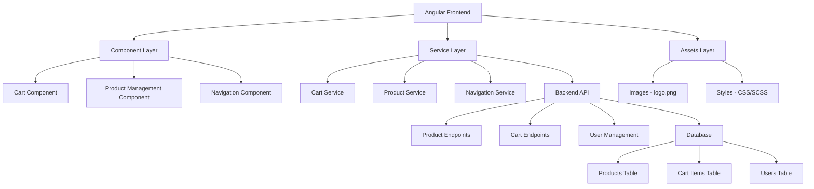

# System Design Specification

## 1. Architecture Overview

### 1.1 High-Level Architecture
This system follows a **Single Page Application (SPA)** architecture using Angular framework with a component-based design pattern. The application appears to be a supermarket management system with shopping cart functionality. The architecture is structured as a client-side application with potential backend API integration for data persistence.

### 1.2 Architecture Diagram


### 1.3 Technology Stack
- **Frontend Framework**: Angular (with TypeScript)
- **UI Components**: Angular Material
- **Styling**: Bootstrap + Custom CSS/SCSS
- **Icons**: Material Icons
- **State Management**: RxJS/Angular Services
- **HTTP Client**: Angular HttpClient
- **Build Tool**: Angular CLI
- **Package Manager**: npm/yarn

**Backend (Recommended)**:
- **Runtime**: Node.js with Express.js or NestJS
- **Database**: PostgreSQL or MongoDB
- **Authentication**: JWT tokens
- **File Upload**: Multer or similar for image handling

## 2. Component Design

### 2.1 Frontend Components

#### Cart Component
```typescript
// cart.component.ts
export class CartComponent {
  // Properties
  cartItems: CartItem[] = [];
  totalPrice: number = 0;
  
  // Methods
  navigateToManageProduct(): void;
  updateCartTotal(): void;
  removeItem(itemId: string): void;
}
```

#### Product Management Component
```typescript
// product-management.component.ts
export class ProductManagementComponent {
  // Properties
  products: Product[] = [];
  selectedProduct: Product | null = null;
  
  // Methods
  addProduct(product: Product): void;
  editProduct(product: Product): void;
  deleteProduct(productId: string): void;
  uploadProductImage(file: File): void;
}
```

#### Navigation Component
```typescript
// navigation.component.ts
export class NavigationComponent {
  // Properties
  logoPath: string = 'assets/images/logo.png';
  navigationItems: NavigationItem[] = [];
  
  // Methods
  navigateToSection(section: string): void;
}
```

### 2.2 Backend Services

#### Product Service
- Handles CRUD operations for products
- Manages product images and metadata
- Implements search and filtering capabilities

#### Cart Service
- Manages shopping cart state
- Handles cart persistence
- Calculates totals and applies discounts

#### File Upload Service
- Handles image uploads for products and logos
- Implements file validation and processing
- Manages static asset serving

## 3. Data Models

### 3.1 Database Schema

```sql
-- Products Table
CREATE TABLE products (
    id UUID PRIMARY KEY DEFAULT gen_random_uuid(),
    name VARCHAR(255) NOT NULL,
    description TEXT,
    price DECIMAL(10,2) NOT NULL,
    image_url VARCHAR(500),
    category_id UUID REFERENCES categories(id),
    stock_quantity INTEGER DEFAULT 0,
    is_active BOOLEAN DEFAULT true,
    created_at TIMESTAMP DEFAULT CURRENT_TIMESTAMP,
    updated_at TIMESTAMP DEFAULT CURRENT_TIMESTAMP
);

-- Categories Table
CREATE TABLE categories (
    id UUID PRIMARY KEY DEFAULT gen_random_uuid(),
    name VARCHAR(100) NOT NULL UNIQUE,
    description TEXT,
    created_at TIMESTAMP DEFAULT CURRENT_TIMESTAMP
);

-- Cart Items Table
CREATE TABLE cart_items (
    id UUID PRIMARY KEY DEFAULT gen_random_uuid(),
    user_id UUID REFERENCES users(id),
    product_id UUID REFERENCES products(id),
    quantity INTEGER NOT NULL DEFAULT 1,
    added_at TIMESTAMP DEFAULT CURRENT_TIMESTAMP
);

-- Users Table
CREATE TABLE users (
    id UUID PRIMARY KEY DEFAULT gen_random_uuid(),
    email VARCHAR(255) UNIQUE NOT NULL,
    password_hash VARCHAR(255) NOT NULL,
    first_name VARCHAR(100),
    last_name VARCHAR(100),
    role VARCHAR(50) DEFAULT 'customer',
    created_at TIMESTAMP DEFAULT CURRENT_TIMESTAMP,
    updated_at TIMESTAMP DEFAULT CURRENT_TIMESTAMP
);

-- System Settings Table (for logo and configurations)
CREATE TABLE system_settings (
    id UUID PRIMARY KEY DEFAULT gen_random_uuid(),
    setting_key VARCHAR(100) UNIQUE NOT NULL,
    setting_value TEXT,
    updated_at TIMESTAMP DEFAULT CURRENT_TIMESTAMP
);
```

### 3.2 Data Flow
1. **User Interaction** → Component → Service → HTTP Request → Backend API
2. **Data Persistence** → Database → API Response → Service → Component → UI Update
3. **Image Assets** → Static File Server → Angular Assets → Component Template

## 4. API Design

### 4.1 Endpoints

#### Product Management
```http
GET /api/products
Response: { products: Product[], total: number, page: number }

POST /api/products
Request: { name: string, description: string, price: number, categoryId: string, imageFile?: File }
Response: { product: Product, message: string }

PUT /api/products/:id
Request: { name?: string, description?: string, price?: number, categoryId?: string }
Response: { product: Product, message: string }

DELETE /api/products/:id
Response: { message: string, success: boolean }
```

#### Cart Management
```http
GET /api/cart
Response: { items: CartItem[], total: number }

POST /api/cart/items
Request: { productId: string, quantity: number }
Response: { item: CartItem, message: string }

PUT /api/cart/items/:id
Request: { quantity: number }
Response: { item: CartItem, message: string }

DELETE /api/cart/items/:id
Response: { message: string, success: boolean }
```

#### File Upload
```http
POST /api/upload/logo
Request: FormData with file
Response: { url: string, message: string }

POST /api/upload/product-image
Request: FormData with file and productId
Response: { url: string, message: string }
```

### 4.2 API Patterns
- **RESTful conventions** with proper HTTP methods
- **JSON responses** with consistent error handling
- **File upload** using multipart/form-data
- **Pagination** for large datasets
- **Filtering and sorting** query parameters

## 5. Security Design

### 5.1 Authentication Strategy
- **JWT tokens** for stateless authentication
- **Refresh token** mechanism for extended sessions
- **Role-based access** (admin, manager, customer)

### 5.2 Authorization
```typescript
// Auth guard example
@Injectable()
export class AdminGuard implements CanActivate {
  canActivate(): boolean {
    return this.authService.hasRole('admin');
  }
}
```

### 5.3 Data Protection
- **HTTPS** for all communications
- **Input validation** on both client and server
- **File upload restrictions** (size, type, malware scanning)
- **SQL injection prevention** using parameterized queries

## 6. Integration Points

### 6.1 External Services
- **Payment Gateway** (Stripe, PayPal) for checkout
- **Email Service** (SendGrid, AWS SES) for notifications
- **Cloud Storage** (AWS S3, Cloudinary) for image hosting
- **Analytics** (Google Analytics) for user behavior tracking

### 6.2 Internal Integrations
- **Component Communication** via Angular services and RxJS
- **State Management** using Angular services with BehaviorSubject
- **Route Guards** for navigation control

## 7. Performance Considerations

### 7.1 Optimization Strategies
- **Lazy Loading** for route modules
- **OnPush Change Detection** for better performance
- **Image Optimization** with compression and CDN
- **HTTP Caching** with appropriate cache headers
- **Bundle Optimization** with tree shaking and code splitting

### 7.2 Scalability
- **Component Reusability** for maintainable code
- **Service Worker** for offline functionality
- **Database Indexing** on frequently queried fields
- **API Rate Limiting** to prevent abuse

## 8. Error Handling and Logging

### 8.1 Error Handling Strategy
```typescript
// Global error handler
@Injectable()
export class GlobalErrorHandler implements ErrorHandler {
  handleError(error: Error): void {
    console.error('Global error:', error);
    // Send to logging service
    this.loggingService.logError(error);
    // Show user-friendly message
    this.notificationService.showError('Something went wrong');
  }
}
```

### 8.2 Logging and Monitoring
- **Client-side logging** for user interactions and errors
- **Server-side logging** for API requests and system events
- **Performance monitoring** for load times and user experience
- **Error tracking** with services like Sentry

## 9. Development Workflow

### 9.1 Project Structure
```
src/
├── app/
│   ├── components/
│   │   ├── cart/
│   │   ├── product-management/
│   │   └── navigation/
│   ├── services/
│   │   ├── cart.service.ts
│   │   ├── product.service.ts
│   │   └── auth.service.ts
│   ├── models/
│   │   ├── product.model.ts
│   │   ├── cart-item.model.ts
│   │   └── user.model.ts
│   ├── guards/
│   ├── interceptors/
│   └── shared/
├── assets/
│   ├── images/
│   │   └── logo.png  # Fixed location
│   └── styles/
└── environments/
```

### 9.2 Development Environment
```bash
# Environment variables
ANGULAR_ENV=development
API_BASE_URL=http://localhost:3000/api
UPLOAD_MAX_SIZE=5MB
```

### 9.3 Testing Strategy
- **Unit Tests** with Jasmine and Karma (>80% coverage)
- **Integration Tests** for service interactions
- **E2E Tests** with Cypress for critical user flows
- **Component Testing** with Angular Testing Utilities

## 10. Deployment Architecture

### 10.1 Deployment Strategy
```yaml
# CI/CD Pipeline (GitHub Actions example)
name: Deploy Supermarket App
on:
  push:
    branches: [main]
jobs:
  deploy:
    runs-on: ubuntu-latest
    steps:
      - name: Build Angular app
        run: ng build --prod
      - name: Deploy to hosting
        run: # Deploy commands
```

### 10.2 Infrastructure
- **Frontend Hosting**: Vercel, Netlify, or AWS S3 + CloudFront
- **Backend Hosting**: AWS EC2, Heroku, or DigitalOcean
- **Database**: AWS RDS PostgreSQL or MongoDB Atlas
- **File Storage**: AWS S3 or Cloudinary for images
- **CDN**: CloudFront or Cloudflare for static assets

## Immediate Fix for Logo Issue

**Problem**: The logo.png is not loading because it's not in the correct Angular assets directory.

**Solution**:
1. Move `logo.png` to `src/assets/images/logo.png`
2. Update the HTML template:
```html

```

**Alternative Solutions**:
- Store logo URL in environment configuration
- Implement dynamic logo loading from backend
- Add fallback image handling for missing assets

This comprehensive design provides a solid foundation for building a scalable supermarket management system with proper asset handling, component architecture, and modern development practices.