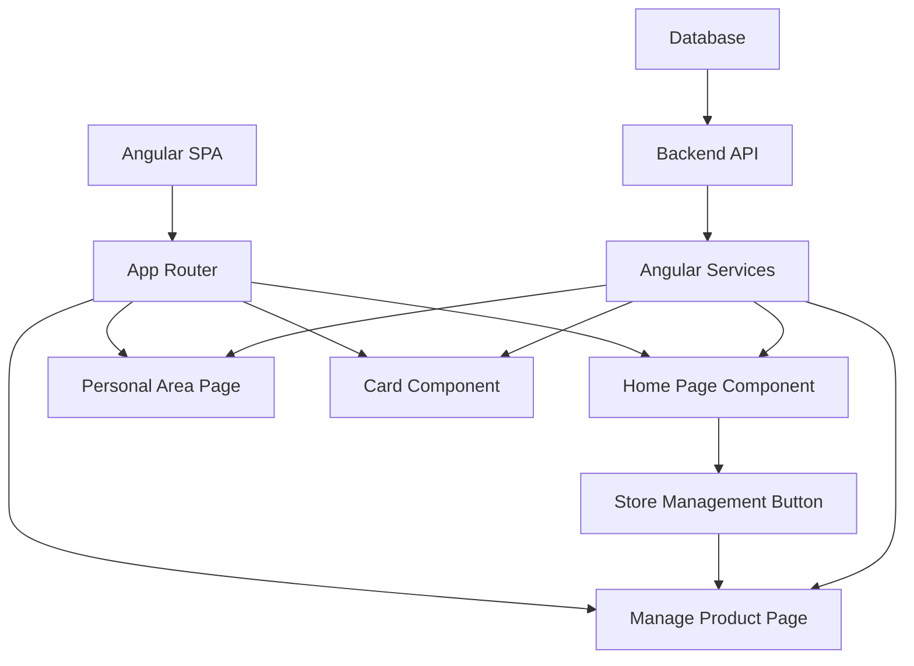

# System Design Specification

## 1. Architecture Overview

### 1.1 High-Level Architecture
This is an **Angular Single Page Application (SPA)** following a client-side routing architecture pattern. The system implements a modular component-based structure with dedicated pages for different business functionalities including home dashboard, personal area management, shopping cart, and product management.

### 1.2 Architecture Diagram


### 1.3 Technology Stack
- **Frontend Framework**: Angular 17+ (with standalone components)
- **Routing**: Angular Router
- **UI Framework**: Angular Material or Bootstrap (recommended)
- **State Management**: Angular Services with RxJS
- **HTTP Client**: Angular HttpClient
- **Build Tool**: Angular CLI with Webpack
- **Package Manager**: npm or yarn

## 2. Component Design

### 2.1 Frontend Components

#### Home Page Component
```typescript
// Location: src/app/pages/home-page/home-page.ts
@Component({
  selector: 'app-home-page',
  template: `
    <div class="home-container">
      <h1>Bienvenido</h1>
      <div class="actions-panel">
        <button 
          class="btn btn-primary store-management-btn"
          (click)="navigateToStoreManagement()">
          Gestión de Tienda
        </button>
        <!-- Other home page content -->
      </div>
    </div>
  `
})
```

**Responsibilities:**
- Display main dashboard/welcome content
- Provide navigation to key system areas
- House the "Gestión de Tienda" button with navigation logic

#### Manage Product Page Component
```typescript
// Location: src/app/pages/manage-product-page/manage-product-page.ts
@Component({
  selector: 'app-manage-product-page',
  template: `
    <div class="product-management-container">
      <h1>Gestión de Productos</h1>
      <!-- Product management interface -->
    </div>
  `
})
```

**Responsibilities:**
- Product CRUD operations interface
- Product listing and filtering
- Product form management

### 2.2 Backend Services (Angular Services)

#### Navigation Service
```typescript
@Injectable({ providedIn: 'root' })
export class NavigationService {
  constructor(private router: Router) {}
  
  navigateToStoreManagement(): void {
    this.router.navigate(['/manage-product']);
  }
}
```

#### Product Service
```typescript
@Injectable({ providedIn: 'root' })
export class ProductService {
  private apiUrl = 'api/products';
  
  constructor(private http: HttpClient) {}
  
  getProducts(): Observable<Product[]> {
    return this.http.get<Product[]>(this.apiUrl);
  }
  
  createProduct(product: Product): Observable<Product> {
    return this.http.post<Product>(this.apiUrl, product);
  }
}
```

### 2.3 Database Layer
- **Pattern**: Repository pattern implemented through Angular Services
- **HTTP Communication**: RESTful API calls using Angular HttpClient
- **State Management**: Local component state with service-based data flow

## 3. Data Models

### 3.1 Database Schema

```typescript
// Product Entity
interface Product {
  id: string;
  name: string;
  description: string;
  price: number;
  category: string;
  imageUrl?: string;
  stock: number;
  isActive: boolean;
  createdAt: Date;
  updatedAt: Date;
}

// User Entity (for personal area)
interface User {
  id: string;
  email: string;
  name: string;
  role: UserRole;
  createdAt: Date;
  updatedAt: Date;
}

// Cart Item Entity
interface CartItem {
  id: string;
  productId: string;
  quantity: number;
  userId: string;
  addedAt: Date;
}

enum UserRole {
  ADMIN = 'admin',
  USER = 'user',
  MANAGER = 'manager'
}
```

### 3.2 Data Flow
1. **User Interaction** → Component methods
2. **Component** → Service method calls
3. **Service** → HTTP requests to backend API
4. **Backend API** → Database operations
5. **Response** flows back through the same chain with Observable patterns

## 4. API Design

### 4.1 Endpoints

```typescript
// Product Management Endpoints
GET /api/products
Response: Product[]
Authentication: Bearer token

POST /api/products
Request: { name: string, description: string, price: number, category: string, stock: number }
Response: Product
Authentication: Bearer token (Admin/Manager only)

PUT /api/products/:id
Request: Partial<Product>
Response: Product
Authentication: Bearer token (Admin/Manager only)

DELETE /api/products/:id
Response: { success: boolean }
Authentication: Bearer token (Admin/Manager only)

// User Management Endpoints
GET /api/users/profile
Response: User
Authentication: Bearer token

PUT /api/users/profile
Request: Partial<User>
Response: User
Authentication: Bearer token

// Cart Management Endpoints
GET /api/cart
Response: CartItem[]
Authentication: Bearer token

POST /api/cart/items
Request: { productId: string, quantity: number }
Response: CartItem
Authentication: Bearer token
```

### 4.2 API Patterns
- **RESTful Design**: Standard HTTP methods for CRUD operations
- **JSON Communication**: All requests/responses in JSON format
- **Error Handling**: Consistent error response format
- **Pagination**: For large data sets (products, orders)

## 5. Security Design

### 5.1 Authentication Strategy
- **JWT Token-based Authentication**
- **Token Storage**: localStorage or sessionStorage
- **Token Refresh**: Automatic token refresh mechanism
- **Route Guards**: Angular guards for protected routes

```typescript
@Injectable()
export class AuthGuard implements CanActivate {
  constructor(private auth: AuthService, private router: Router) {}
  
  canActivate(): boolean {
    if (this.auth.isAuthenticated()) {
      return true;
    }
    this.router.navigate(['/login']);
    return false;
  }
}
```

### 5.2 Authorization
- **Role-based Access Control (RBAC)**
- **Component-level permissions**
- **Route-level restrictions**

### 5.3 Data Protection
- **Input Validation**: Angular reactive forms with validators
- **XSS Protection**: Angular's built-in sanitization
- **CSRF Protection**: Angular's CSRF token handling

## 6. Integration Points

### 6.1 External Services
- **Payment Gateway**: Stripe/PayPal integration for e-commerce
- **Image Storage**: Cloudinary or AWS S3 for product images
- **Email Service**: SendGrid for notifications
- **Analytics**: Google Analytics for user behavior tracking

### 6.2 Internal Integrations
- **Component Communication**: @Input/@Output decorators and services
- **State Sharing**: Singleton services with BehaviorSubject
- **Event Bus**: Angular services for cross-component communication

## 7. Performance Considerations

### 7.1 Optimization Strategies
- **Lazy Loading**: Route-based code splitting
- **OnPush Change Detection**: For performance-critical components
- **TrackBy Functions**: For efficient *ngFor rendering
- **Image Optimization**: WebP format and lazy loading
- **Caching**: HTTP interceptors for API response caching

```typescript
// Lazy loading example for routes
const routes: Routes = [
  {
    path: 'manage-product',
    loadComponent: () => import('./pages/manage-product-page/manage-product-page').then(m => m.ManageProductPage)
  }
];
```

### 7.2 Scalability
- **Modular Architecture**: Feature-based module organization
- **Standalone Components**: Angular 17+ standalone component pattern
- **Service Worker**: PWA capabilities for offline functionality

## 8. Error Handling and Logging

### 8.1 Error Handling Strategy
```typescript
@Injectable()
export class ErrorInterceptor implements HttpInterceptor {
  intercept(req: HttpRequest<any>, next: HttpHandler): Observable<HttpEvent<any>> {
    return next.handle(req).pipe(
      catchError((error: HttpErrorResponse) => {
        // Global error handling logic
        this.notificationService.showError(error.message);
        return throwError(() => error);
      })
    );
  }
}
```

### 8.2 Logging and Monitoring
- **Console Logging**: Development environment
- **Remote Logging**: Production environment (Sentry, LogRocket)
- **User Action Tracking**: Analytics integration

## 9. Development Workflow

### 9.1 Project Structure
```
src/
├── app/
│   ├── components/
│   │   └── card/
│   ├── pages/
│   │   ├── home-page/
│   │   ├── personal-area-page/
│   │   └── manage-product-page/
│   ├── services/
│   ├── models/
│   ├── guards/
│   ├── interceptors/
│   └── app.routes.ts
├── assets/
└── environments/
```

### 9.2 Development Environment
```typescript
// environment.ts
export const environment = {
  production: false,
  apiUrl: 'http://localhost:3000/api',
  enableLogging: true
};
```

### 9.3 Testing Strategy
- **Unit Testing**: Jasmine + Karma for component testing
- **E2E Testing**: Cypress for end-to-end scenarios
- **Service Testing**: Mock HTTP requests with HttpClientTestingModule
- **Coverage Goal**: 80% code coverage minimum

## 10. Deployment Architecture

### 10.1 Deployment Strategy
- **Build Process**: `ng build --prod` for production builds
- **CI/CD Pipeline**: GitHub Actions or Azure DevOps
- **Environment Promotion**: Dev → Staging → Production

### 10.2 Infrastructure
- **Frontend Hosting**: Vercel, Netlify, or AWS S3 + CloudFront
- **Backend API**: Node.js/Express on AWS EC2 or Heroku
- **Database**: PostgreSQL on AWS RDS or MongoDB Atlas
- **CDN**: CloudFlare for static asset delivery

## Implementation Notes

### Immediate Task: Store Management Button
```typescript
// In home-page.component.ts
import { Router } from '@angular/router';

@Component({
  selector: 'app-home-page',
  standalone: true,
  template: `
    <div class="home-dashboard">
      <h1>Panel de Control</h1>
      <div class="quick-actions">
        <button 
          type="button"
          class="btn btn-primary btn-lg"
          (click)="navigateToStoreManagement()">
          <i class="fas fa-store"></i>
          Gestión de Tienda
        </button>
      </div>
    </div>
  `,
  styles: [`
    .quick-actions {
      margin-top: 2rem;
    }
    
    .btn-lg {
      padding: 1rem 2rem;
      font-size: 1.2rem;
    }
    
    .fas {
      margin-right: 0.5rem;
    }
  `]
})
export class HomePageComponent {
  constructor(private router: Router) {}
  
  navigateToStoreManagement(): void {
    this.router.navigate(['/manage-product']);
  }
}
```

This design specification provides a comprehensive blueprint for building a scalable Angular e-commerce application with proper routing, component architecture, and modern development practices.