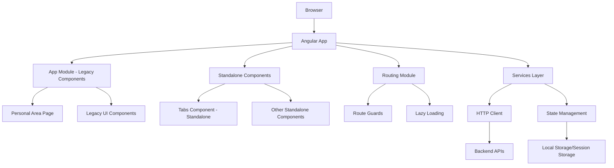
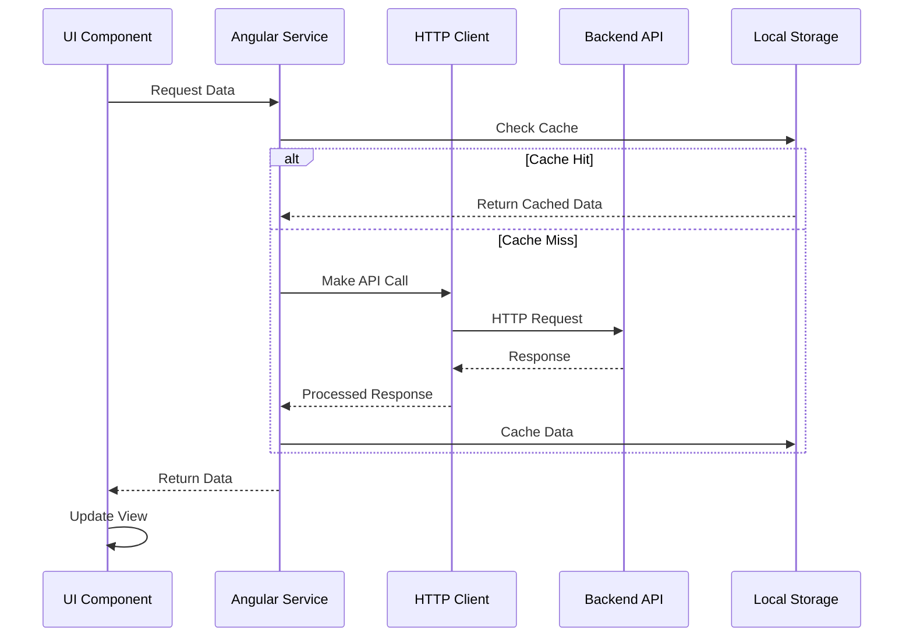

# System Design Specification

## 1. Architecture Overview

### 1.1 High-Level Architecture
This system follows a **Component-Based Single Page Application (SPA)** architecture using Angular 17+ with standalone components. The application uses a hybrid approach where the main app module handles legacy components while newer components are implemented as standalone components with modern Angular patterns.

### 1.2 Architecture Diagram


### 1.3 Technology Stack
- **Frontend Framework**: Angular 17+ (with standalone components)
- **UI Components**: Custom component library with Material Design influence
- **Routing**: Angular Router with lazy loading
- **Animations**: Angular Animations API
- **State Management**: Angular Services with RxJS
- **HTTP Client**: Angular HttpClient
- **Build Tool**: Angular CLI with Vite/esbuild
- **Package Manager**: npm/yarn
- **Development Server**: Angular Dev Server

## 2. Component Design

### 2.1 Frontend Components

#### 2.1.1 Legacy Components (NgModule-based)
- **App**: Root application component
- **PersonalAreaPage**: User dashboard and profile management
- **CardComponent**: Reusable card UI element
- **CartComponent**: Shopping cart functionality
- **HeaderComponent**: Application header with navigation
- **HeaderMenuComponent**: Dropdown/mobile menu for header
- **ImageUploaderComponent**: File upload with image preview
- **NotificationComponent**: Toast/alert notifications
- **SearchBarComponent**: Global search functionality
- **SideMenuComponent**: Navigation sidebar
- **TableComponent**: Data table with sorting/filtering

#### 2.1.2 Standalone Components (Modern Angular)
- **TabsComponent**: Tab interface component (needs to be imported, not declared)

### 2.2 Backend Services (Angular Services)
```typescript
// Core service structure
interface ServiceArchitecture {
  // Data Services
  UserService: 'User management and authentication';
  ProductService: 'Product catalog operations';
  CartService: 'Shopping cart state management';
  NotificationService: 'System notifications';
  
  // Utility Services
  HttpService: 'HTTP interceptors and error handling';
  StorageService: 'Local/session storage abstraction';
  ValidationService: 'Form validation logic';
  ImageService: 'Image upload and processing';
}
```

### 2.3 Database Layer
The frontend interacts with backend APIs through Angular's HttpClient with proper error handling and interceptors.

## 3. Data Models

### 3.1 Frontend Data Models
```typescript
// User Model
interface User {
  id: string;
  email: string;
  firstName: string;
  lastName: string;
  profileImage?: string;
  preferences: UserPreferences;
  createdAt: Date;
  updatedAt: Date;
}

// Product Model
interface Product {
  id: string;
  name: string;
  description: string;
  price: number;
  images: string[];
  category: Category;
  inStock: boolean;
  tags: string[];
}

// Cart Model
interface CartItem {
  productId: string;
  quantity: number;
  selectedVariant?: ProductVariant;
}

interface Cart {
  id: string;
  userId: string;
  items: CartItem[];
  totalAmount: number;
  currency: string;
}

// Notification Model
interface Notification {
  id: string;
  type: 'success' | 'error' | 'warning' | 'info';
  title: string;
  message: string;
  timestamp: Date;
  isRead: boolean;
  autoClose?: boolean;
}

// Table Data Model
interface TableColumn {
  key: string;
  label: string;
  sortable: boolean;
  filterable: boolean;
  type: 'text' | 'number' | 'date' | 'boolean' | 'action';
}

interface TableData<T> {
  columns: TableColumn[];
  rows: T[];
  pagination: PaginationInfo;
  sorting: SortInfo;
  filters: FilterInfo;
}
```

### 3.2 Data Flow


## 4. API Design

### 4.1 Endpoints
```typescript
// Authentication
POST /api/auth/login
Request: { email: string, password: string }
Response: { user: User, token: string, refreshToken: string }

POST /api/auth/logout
Request: { refreshToken: string }
Response: { success: boolean }

// User Management
GET /api/users/profile
Response: { user: User }
Authentication: Bearer Token Required

PUT /api/users/profile
Request: Partial<User>
Response: { user: User }

// Products
GET /api/products
Query: { page?: number, limit?: number, category?: string, search?: string }
Response: { products: Product[], total: number, pagination: PaginationInfo }

GET /api/products/:id
Response: { product: Product }

// Cart
GET /api/cart
Response: { cart: Cart }

POST /api/cart/items
Request: { productId: string, quantity: number, variantId?: string }
Response: { cart: Cart }

PUT /api/cart/items/:itemId
Request: { quantity: number }
Response: { cart: Cart }

DELETE /api/cart/items/:itemId
Response: { cart: Cart }

// File Upload
POST /api/upload/image
Request: FormData with image file
Response: { url: string, id: string }
```

### 4.2 API Patterns
- **RESTful conventions** with proper HTTP status codes
- **Consistent response format**:
  ```typescript
  interface ApiResponse<T> {
    success: boolean;
    data: T;
    message?: string;
    errors?: ValidationError[];
  }
  ```
- **Pagination pattern**:
  ```typescript
  interface PaginatedResponse<T> {
    data: T[];
    pagination: {
      current: number;
      total: number;
      per_page: number;
      last_page: number;
    };
  }
  ```

## 5. Security Design

### 5.1 Authentication Strategy
- **JWT-based authentication** with access and refresh tokens
- **Token storage**: HttpOnly cookies for refresh tokens, memory storage for access tokens
- **Token rotation**: Automatic refresh token rotation on use
- **Session management**: Automatic logout on token expiration

### 5.2 Authorization
- **Role-based access control (RBAC)**:
  ```typescript
  enum UserRole {
    ADMIN = 'admin',
    USER = 'user',
    MODERATOR = 'moderator'
  }
  
  interface Permission {
    resource: string;
    actions: ('create' | 'read' | 'update' | 'delete')[];
  }
  ```
- **Route guards**: CanActivate guards for protected routes
- **Component-level permissions**: Conditional rendering based on user roles

### 5.3 Data Protection
- **Input validation**: Angular reactive forms with custom validators
- **XSS prevention**: Angular's built-in sanitization
- **CSRF protection**: CSRF tokens for state-changing operations
- **Content Security Policy (CSP)**: Strict CSP headers
- **Image upload security**: File type validation and size limits

## 6. Integration Points

### 6.1 External Services
```typescript
interface ExternalServices {
  paymentGateway: {
    provider: 'Stripe' | 'PayPal';
    webhooks: string[];
    apiKeys: EnvironmentConfig;
  };
  
  emailService: {
    provider: 'SendGrid' | 'AWS SES';
    templates: EmailTemplate[];
  };
  
  cloudStorage: {
    provider: 'AWS S3' | 'Cloudinary';
    buckets: string[];
    cdnUrl: string;
  };
  
  analytics: {
    provider: 'Google Analytics' | 'Mixpanel';
    trackingId: string;
  };
}
```

### 6.2 Internal Integrations
- **Service Communication**: Angular's Dependency Injection system
- **State Sharing**: RxJS Subjects and BehaviorSubjects
- **Event System**: Custom event emitters and observables
- **Component Communication**: @Input/@Output decorators and services

## 7. Performance Considerations

### 7.1 Optimization Strategies
```typescript
// Lazy Loading Configuration
const routes: Routes = [
  {
    path: 'admin',
    loadChildren: () => import('./admin/admin.module').then(m => m.AdminModule)
  },
  {
    path: 'products',
    loadComponent: () => import('./components/product-list/product-list.component')
  }
];

// OnPush Change Detection Strategy
@Component({
  changeDetection: ChangeDetectionStrategy.OnPush,
  // ...
})

// TrackBy Functions for *ngFor
trackByProductId(index: number, product: Product): string {
  return product.id;
}
```

- **Bundle Optimization**: Tree shaking and code splitting
- **Image Optimization**: WebP format with fallbacks, lazy loading
- **Caching Strategy**: HTTP caching headers, service worker caching
- **Virtual Scrolling**: For large data sets in tables

### 7.2 Scalability
- **Modular Architecture**: Feature modules for different app sections
- **Standalone Components**: Gradual migration to standalone components
- **Micro-frontend Ready**: Architecture supports future micro-frontend splitting
- **CDN Integration**: Static asset delivery through CDN

## 8. Error Handling and Logging

### 8.1 Error Handling Strategy
```typescript
// Global Error Handler
@Injectable()
export class GlobalErrorHandler implements ErrorHandler {
  handleError(error: any): void {
    console.error('Global error:', error);
    
    if (error instanceof HttpErrorResponse) {
      this.handleHttpError(error);
    } else if (error instanceof TypeError) {
      this.handleTypeError(error);
    } else {
      this.handleGenericError(error);
    }
  }
}

// HTTP Error Interceptor
@Injectable()
export class ErrorInterceptor implements HttpInterceptor {
  intercept(req: HttpRequest<any>, next: HttpHandler): Observable<HttpEvent<any>> {
    return next.handle(req).pipe(
      catchError((error: HttpErrorResponse) => {
        this.handleError(error);
        return throwError(error);
      })
    );
  }
}
```

### 8.2 Logging and Monitoring
- **Frontend Logging**: Custom logger service with different log levels
- **Error Tracking**: Integration with Sentry or similar service
- **Performance Monitoring**: Core Web Vitals tracking
- **User Analytics**: User interaction tracking and funnel analysis

## 9. Development Workflow

### 9.1 Project Structure
```
src/
├── app/
│   ├── components/          # Reusable UI components
│   │   ├── card/
│   │   ├── tabs/           # Standalone component
│   │   └── ...
│   ├── pages/              # Page-level components
│   ├── services/           # Business logic services
│   ├── models/             # TypeScript interfaces
│   ├── guards/             # Route guards
│   ├── interceptors/       # HTTP interceptors
│   ├── pipes/              # Custom pipes
│   ├── directives/         # Custom directives
│   └── shared/             # Shared utilities
├── assets/                 # Static assets
├── environments/           # Environment configurations
└── styles/                 # Global styles
```

### 9.2 Development Environment
```typescript
// Environment Configuration
interface Environment {
  production: boolean;
  apiUrl: string;
  auth: {
    clientId: string;
    issuer: string;
  };
  features: {
    enableAnalytics: boolean;
    enableLogging: boolean;
  };
}
```

**Required Dependencies**:
- Node.js 18+
- Angular CLI 17+
- TypeScript 5+

### 9.3 Testing Strategy
```typescript
// Unit Testing Example
describe('TabsComponent', () => {
  let component: TabsComponent;
  let fixture: ComponentFixture<TabsComponent>;

  beforeEach(async () => {
    await TestBed.configureTestingModule({
      imports: [TabsComponent] // Import standalone component
    }).compileComponents();
  });

  it('should create', () => {
    expect(component).toBeTruthy();
  });
});
```

- **Unit Tests**: Jest with Angular Testing Library
- **Integration Tests**: Component integration with services
- **E2E Tests**: Cypress or Playwright
- **Coverage Goal**: 80% code coverage minimum

## 10. Deployment Architecture

### 10.1 Deployment Strategy
```yaml
# CI/CD Pipeline (GitHub Actions example)
name: Deploy
on:
  push:
    branches: [main]

jobs:
  deploy:
    runs-on: ubuntu-latest
    steps:
      - uses: actions/checkout@v3
      - name: Setup Node.js
        uses: actions/setup-node@v3
        with:
          node-version: '18'
      - name: Install dependencies
        run: npm ci
      - name: Run tests
        run: npm run test:ci
      - name: Build
        run: npm run build:prod
      - name: Deploy
        run: npm run deploy
```

### 10.2 Infrastructure
- **Hosting**: Vercel, Netlify, or AWS S3 + CloudFront
- **CDN**: CloudFront or Cloudflare for global content delivery
- **SSL**: Automatic HTTPS with Let's Encrypt or cloud provider certificates
- **Monitoring**: Uptime monitoring and performance tracking

## Fix for Current Issue

The immediate fix for the `TabsComponent` error is to move it from `declarations` to `imports` in the AppModule:

```typescript
@NgModule({
  declarations: [
    App,
    PersonalAreaPage,
    CardComponent,
    CartComponent,
    HeaderComponent,
    HeaderMenuComponent,
    ImageUploaderComponent,
    NotificationComponent,
    SearchBarComponent,
    SideMenuComponent,
    TableComponent
    // Remove TabsComponent from here
  ],
  imports: [
    BrowserModule,
    RouterModule.forRoot(routes),
    BrowserAnimationsModule,
    TabsComponent // Add TabsComponent here instead
  ],
  providers: [],
  bootstrap: [App]
})
export class AppModule { }
```

This design specification provides a comprehensive blueprint for building a modern Angular application with a hybrid architecture that supports both legacy NgModule components and modern standalone components, enabling gradual migration while maintaining functionality and performance.