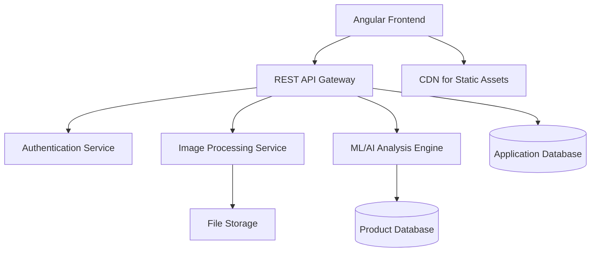
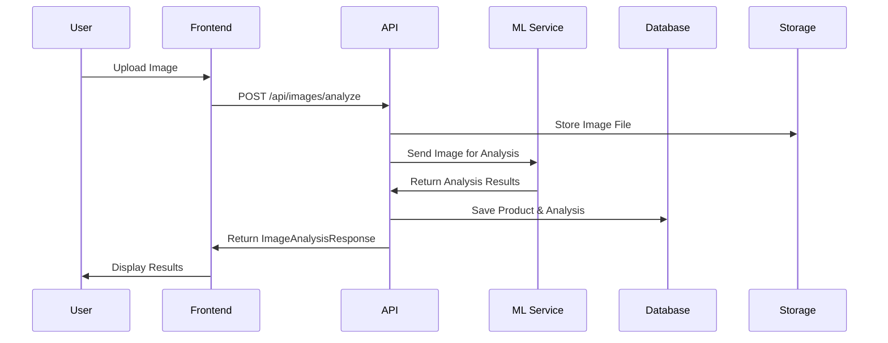

# System Design Specification

## 1. Architecture Overview

### 1.1 High-Level Architecture
The system follows a **client-server architecture** with a modern Angular frontend communicating with a RESTful backend API for image analysis and product recognition. The architecture supports real-time image processing with AI/ML capabilities for automated product identification and categorization.



### 1.2 Architecture Diagram
```
┌─────────────────────────────────────────────────────────────┐
│                    Frontend Layer                           │
│  ┌─────────────┐  ┌─────────────┐  ┌─────────────────────┐ │
│  │   Angular   │  │  Components │  │    Services &       │ │
│  │     App     │  │     UI      │  │   State Management  │ │
│  └─────────────┘  └─────────────┘  └─────────────────────┘ │
└─────────────────────────────────────────────────────────────┘
                              │
                         HTTP/HTTPS
                              │
┌──────────��─��────────────────────────────────────────────────┐
│                    Backend Layer                            │
│  ┌─────────────┐  ┌─────────────┐  ┌─────────────────────┐ │
│  │   API       │  │   Image     │  │    ML/AI           │ │
│  │  Gateway    │  │ Processing  │  │   Analysis         │ │
│  └─────────────┘  └─────────────┘  └─────────────────────┘ │
└─────────────────────────────────────────────────────────────┘
                              │
┌─────────────────────────────────────���─���─────────────────────┐
│                    Data Layer                               │
│  ┌─────────────┐  ┌─────────────┐  ┌─────────────────────┐ │
│  │  PostgreSQL │  │   Redis     │  │    File Storage     │ │
│  │  Database   │  │   Cache     │  │   (AWS S3/Local)    │ │
│  └─────────────┘  └─────────────┘  └─────────────────────┘ │
└─────────────────────────────────────────────────────────────┘
```

### 1.3 Technology Stack

**Frontend Technologies:**
- Angular 17+ (with standalone components)
- TypeScript 5+
- RxJS for reactive programming
- Angular Material or PrimeNG for UI components
- TailwindCSS for styling

**Backend Technologies:**
- Node.js with Express.js or NestJS
- TypeScript
- Multer for file upload handling
- Sharp or ImageMagick for image processing
- TensorFlow.js or Python-based ML service

**Database Systems:**
- PostgreSQL (primary database)
- Redis (caching and session storage)

**Third-party Services and APIs:**
- AWS S3 or Google Cloud Storage (file storage)
- TensorFlow/PyTorch ML models
- Stripe (payment processing)
- SendGrid (email notifications)

**Development Tools:**
- Docker for containerization
- Jest for testing
- ESLint/Prettier for code quality
- GitHub Actions for CI/CD

## 2. Component Design

### 2.1 Frontend Components

**Core Components:**
```typescript
// Main application components
- AppComponent (root)
- HeaderComponent (navigation, logo)
- ImageUploaderComponent (file upload interface)
- ImageAnalysisComponent (analysis results display)
- PersonalAreaComponent (user dashboard)
- ProductFormComponent (manual product entry)
- LoadingSpinnerComponent (async operation feedback)
```

**Service Layer:**
```typescript
- ApiService (HTTP communication)
- AuthService (authentication management)
- FileService (file handling utilities)
- StateService (application state management)
- NotificationService (user feedback)
```

### 2.2 Backend Services

**API Services:**
- **Authentication Service**: JWT-based user authentication
- **Image Upload Service**: File validation and storage
- **Image Analysis Service**: ML/AI integration for product recognition
- **Product Management Service**: CRUD operations for products
- **User Management Service**: User profile and preferences

**Processing Services:**
- **Image Processing Pipeline**: Resize, format conversion, optimization
- **ML Inference Service**: Product categorization and attribute extraction
- **Notification Service**: Email and push notifications

### 2.3 Database Layer

**Data Access Pattern:**
- Repository pattern with TypeORM or Prisma
- Connection pooling for performance
- Read replicas for scalability
- Redis for caching frequently accessed data

## 3. Data Models

### 3.1 Database Schema

```sql
-- Users Table
CREATE TABLE users (
  id UUID PRIMARY KEY DEFAULT gen_random_uuid(),
  email VARCHAR(255) UNIQUE NOT NULL,
  password_hash VARCHAR(255) NOT NULL,
  first_name VARCHAR(100),
  last_name VARCHAR(100),
  avatar_url VARCHAR(500),
  created_at TIMESTAMP DEFAULT CURRENT_TIMESTAMP,
  updated_at TIMESTAMP DEFAULT CURRENT_TIMESTAMP
);

-- Products Table
CREATE TABLE products (
  id UUID PRIMARY KEY DEFAULT gen_random_uuid(),
  user_id UUID REFERENCES users(id) ON DELETE CASCADE,
  name VARCHAR(255) NOT NULL,
  type VARCHAR(100),
  category VARCHAR(100),
  weight DECIMAL(10,2),
  price DECIMAL(10,2),
  currency VARCHAR(3) DEFAULT 'USD',
  description TEXT,
  image_url VARCHAR(500),
  analysis_confidence DECIMAL(3,2),
  created_at TIMESTAMP DEFAULT CURRENT_TIMESTAMP,
  updated_at TIMESTAMP DEFAULT CURRENT_TIMESTAMP
);

-- Image Analysis Table
CREATE TABLE image_analyses (
  id UUID PRIMARY KEY DEFAULT gen_random_uuid(),
  product_id UUID REFERENCES products(id) ON DELETE CASCADE,
  original_filename VARCHAR(255),
  file_path VARCHAR(500),
  file_size INTEGER,
  mime_type VARCHAR(100),
  analysis_status VARCHAR(50) DEFAULT 'pending',
  ml_predictions JSONB,
  processing_time_ms INTEGER,
  created_at TIMESTAMP DEFAULT CURRENT_TIMESTAMP
);

-- User Sessions Table
CREATE TABLE user_sessions (
  id UUID PRIMARY KEY DEFAULT gen_random_uuid(),
  user_id UUID REFERENCES users(id) ON DELETE CASCADE,
  token_hash VARCHAR(255) NOT NULL,
  expires_at TIMESTAMP NOT NULL,
  created_at TIMESTAMP DEFAULT CURRENT_TIMESTAMP
);
```

### 3.2 TypeScript Data Models

```typescript
export interface User {
  id: string;
  email: string;
  firstName?: string;
  lastName?: string;
  avatarUrl?: string;
  createdAt: Date;
  updatedAt: Date;
}

export interface Product {
  id: string;
  userId: string;
  name: string;
  type?: string;
  category?: string;
  weight?: number;
  price?: number;
  currency: string;
  description?: string;
  imageUrl?: string;
  analysisConfidence?: number;
  createdAt: Date;
  updatedAt: Date;
}

export interface ImageAnalysisResponse {
  type: string;
  weight: string;
  price: string;
  category: string;
  confidence?: number;
  predictions?: MLPrediction[];
}

export interface MLPrediction {
  label: string;
  confidence: number;
  boundingBox?: BoundingBox;
}
```

### 3.3 Data Flow



## 4. API Design

### 4.1 Endpoints

**Authentication Endpoints:**
```
POST /api/auth/register
Request: { email: string, password: string, firstName?: string, lastName?: string }
Response: { user: User, token: string }
Authentication: None

POST /api/auth/login
Request: { email: string, password: string }
Response: { user: User, token: string }
Authentication: None

POST /api/auth/logout
Request: {}
Response: { message: string }
Authentication: Bearer Token
```

**Image Analysis Endpoints:**
```
POST /api/images/analyze
Request: FormData with 'image' field (multipart/form-data)
Response: ImageAnalysisResponse
Authentication: Bearer Token (optional for demo)

GET /api/images/analysis/:id
Request: { id: string }
Response: ImageAnalysisResponse with full details
Authentication: Bearer Token
```

**Product Management Endpoints:**
```
GET /api/products
Query: { page?: number, limit?: number, category?: string }
Response: { products: Product[], total: number, page: number }
Authentication: Bearer Token

POST /api/products
Request: Partial<Product>
Response: Product
Authentication: Bearer Token

PUT /api/products/:id
Request: Partial<Product>
Response: Product
Authentication: Bearer Token

DELETE /api/products/:id
Response: { message: string }
Authentication: Bearer Token
```

**System Endpoints:**
```
GET /api/health
Response: { status: 'healthy' | 'unhealthy', timestamp: string, version: string }
Authentication: None
```

### 4.2 API Patterns

**RESTful Conventions:**
- GET for data retrieval
- POST for creation
- PUT for updates
- DELETE for removal
- Consistent URL patterns: `/api/resource` and `/api/resource/:id`

**Error Response Format:**
```typescript
interface ApiErrorResponse {
  error: {
    code: string;
    message: string;
    details?: any;
  };
  timestamp: string;
  path: string;
}
```

**Success Response Format:**
```typescript
interface ApiSuccessResponse<T> {
  data: T;
  message?: string;
  meta?: {
    page?: number;
    limit?: number;
    total?: number;
  };
}
```

## 5. Security Design

### 5.1 Authentication Strategy

**JWT-based Authentication:**
- Access tokens with 1-hour expiration
- Refresh tokens with 7-day expiration
- Secure HTTP-only cookies for token storage
- CSRF protection for cookie-based auth

```typescript
interface JWTPayload {
  sub: string; // user ID
  email: string;
  iat: number;
  exp: number;
  type: 'access' | 'refresh';
}
```

### 5.2 Authorization

**Role-Based Access Control:**
```typescript
enum UserRole {
  USER = 'user',
  ADMIN = 'admin',
  MODERATOR = 'moderator'
}

interface Permission {
  resource: string;
  action: 'create' | 'read' | 'update' | 'delete';
  condition?: string;
}
```

**Resource-Level Permissions:**
- Users can only access their own products
- Admins can access all resources
- Public endpoints for health checks and image analysis demo

### 5.3 Data Protection

**Security Measures:**
- bcrypt for password hashing (rounds: 12)
- Rate limiting: 100 requests per 15 minutes per IP
- Input validation using Joi or class-validator
- SQL injection prevention via parameterized queries
- XSS protection with Content Security Policy
- HTTPS enforcement in production
- File upload restrictions (size, type, virus scanning)

```typescript
const fileValidation = {
  maxSize: 10 * 1024 * 1024, // 10MB
  allowedTypes: ['image/jpeg', 'image/png', 'image/webp'],
  maxDimensions: { width: 4096, height: 4096 }
};
```

## 6. Integration Points

### 6.1 External Services

**File Storage Integration:**
```typescript
interface StorageService {
  uploadFile(file: Buffer, key: string): Promise<string>;
  deleteFile(key: string): Promise<void>;
  getSignedUrl(key: string, expiresIn: number): Promise<string>;
}
```

**ML/AI Service Integration:**
```typescript
interface MLService {
  analyzeImage(imageBuffer: Buffer): Promise<MLPrediction[]>;
  getModelVersion(): Promise<string>;
  healthCheck(): Promise<boolean>;
}
```

**Email Service Integration:**
```typescript
interface EmailService {
  sendWelcomeEmail(user: User): Promise<void>;
  sendPasswordReset(email: string, token: string): Promise<void>;
  sendAnalysisComplete(user: User, analysis: ImageAnalysisResponse): Promise<void>;
}
```

### 6.2 Internal Integrations

**Service Communication:**
- HTTP REST for synchronous operations
- Event-driven architecture for async operations
- Redis pub/sub for real-time notifications
- Message queues for image processing pipeline

## 7. Performance Considerations

### 7.1 Optimization Strategies

**Caching Strategy:**
```typescript
// Redis cache configuration
const cacheConfig = {
  userSessions: { ttl: 3600 }, // 1 hour
  analysisResults: { ttl: 86400 }, // 24 hours
  productLists: { ttl: 300 }, // 5 minutes
  staticContent: { ttl: 604800 } // 1 week
};
```

**Database Optimization:**
```sql
-- Essential indexes
CREATE INDEX idx_products_user_id ON products(user_id);
CREATE INDEX idx_products_category ON products(category);
CREATE INDEX idx_products_created_at ON products(created_at DESC);
CREATE INDEX idx_image_analyses_product_id ON image_analyses(product_id);
CREATE INDEX idx_user_sessions_token_hash ON user_sessions(token_hash);
```

**Frontend Optimization:**
- Lazy loading for route modules
- OnPush change detection strategy
- Virtual scrolling for large lists
- Image compression and WebP format
- Service worker for offline capabilities

### 7.2 Scalability

**Horizontal Scaling:**
- Stateless API design
- Load balancer (Nginx/HAProxy)
- Database read replicas
- CDN for static assets
- Container orchestration (Kubernetes)

**Performance Targets:**
- API response time: < 500ms (95th percentile)
- Image analysis: < 30 seconds
- Database queries: < 100ms
- Frontend load time: < 3 seconds

## 8. Error Handling and Logging

### 8.1 Error Handling Strategy

**Frontend Error Handling:**
```typescript
export class GlobalErrorHandler implements ErrorHandler {
  handleError(error: any): void {
    console.error('Global error:', error);
    
    if (error instanceof HttpErrorResponse) {
      this.handleHttpError(error);
    } else {
      this.handleClientError(error);
    }
  }
  
  private handleHttpError(error: HttpErrorResponse): void {
    switch (error.status) {
      case 401:
        this.authService.logout();
        break;
      case 413:
        this.notificationService.showError('File too large');
        break;
      default:
        this.notificationService.showError('An error occurred');
    }
  }
}
```

**Backend Error Handling:**
```typescript
export class AppError extends Error {
  constructor(
    public message: string,
    public statusCode: number,
    public code: string,
    public isOperational: boolean = true
  ) {
    super(message);
    Object.setPrototypeOf(this, AppError.prototype);
  }
}

// Error codes
export const ErrorCodes = {
  VALIDATION_ERROR: 'VALIDATION_ERROR',
  IMAGE_PROCESSING_FAILED: 'IMAGE_PROCESSING_FAILED',
  ML_SERVICE_UNAVAILABLE: 'ML_SERVICE_UNAVAILABLE',
  FILE_TOO_LARGE: 'FILE_TOO_LARGE',
  UNSUPPORTED_FILE_TYPE: 'UNSUPPORTED_FILE_TYPE'
} as const;
```

### 8.2 Logging and Monitoring

**Structured Logging:**
```typescript
interface LogEntry {
  timestamp: string;
  level: 'debug' | 'info' | 'warn' | 'error';
  message: string;
  userId?: string;
  requestId?: string;
  metadata?: Record<string, any>;
}
```

**Monitoring Metrics:**
- Request/response times
- Error rates by endpoint
- Image processing success/failure rates
- Database connection pool status
- Memory and CPU usage
- File upload metrics

## 9. Development Workflow

### 9.1 Project Structure

```
src/
├── app/
│   ├── components/
│   │   ├── image-uploader/
│   │   ├── image-analysis/
│   │   └── personal-area/
│   ├── services/
│   │   ├── api.service.ts
│   │   ├── auth.service.ts
│   │   └── file.service.ts
│   ├── models/
│   │   ├── user.model.ts
│   │   └── product.model.ts
│   ├── guards/
│   │   └── auth.guard.ts
│   ├── interceptors/
│   │   └── auth.interceptor.ts
│   └── shared/
│       ├── components/
│       └── pipes/
├── assets/
│   ├── images/
│   │   └── logo.png (increased size)
│   └── styles/
└── environments/
```

### 9.2 Development Environment

**Environment Variables:**
```typescript
export const environment = {
  production: false,
  apiUrl: 'http://localhost:3000/api',
  mlServiceUrl: 'http://localhost:5000',
  fileUploadMaxSize: 10 * 1024 * 1024,
  jwtSecret: process.env['JWT_SECRET'],
  databaseUrl: process.env['DATABASE_URL'],
  redisUrl: process.env['REDIS_URL'],
  awsAccessKey: process.env['AWS_ACCESS_KEY'],
  awsSecretKey: process.env['AWS_SECRET_KEY']
};
```

**Local Setup Requirements:**
- Node.js 18+
- Angular CLI 17+
- PostgreSQL 14+
- Redis 6+
- Docker and Docker Compose

### 9.3 Testing Strategy

**Testing Pyramid:**
```typescript
// Unit Tests (70%)
describe('ApiService', () => {
  let service: ApiService;
  let httpMock: HttpTestingController;

  beforeEach(() => {
    TestBed.configureTestingModule({
      imports: [HttpClientTestingModule],
      providers: [ApiService]
    });
    service = TestBed.inject(ApiService);
    httpMock = TestBed.inject(HttpTestingController);
  });

  it('should analyze image successfully', () => {
    const mockFile = new File([''], 'test.jpg', { type: 'image/jpeg' });
    const mockResponse: ImageAnalysisResponse = {
      type: 'Electronics',
      weight: '1.2kg',
      price: '$299',
      category: 'Smartphone'
    };

    service.analyzeImage(mockFile).subscribe(response => {
      expect(response).toEqual(mockResponse);
    });

    const req = httpMock.expectOne('/api/images/analyze');
    expect(req.request.method).toBe('POST');
    req.flush(mockResponse);
  });
});
```

**Integration Tests (20%):**
- API endpoint testing
- Database integration tests
- File upload/processing tests

**E2E Tests (10%):**
- Critical user journeys
- Image upload and analysis flow
- Authentication flows

**Test Coverage Goals:**
- Unit tests: > 80%
- Integration tests: > 60%
- E2E tests: Cover critical paths

## 10. Deployment Architecture

### 10.1 Deployment Strategy

**CI/CD Pipeline:**
```yaml
# .github/workflows/deploy.yml
name: Deploy Application
on:
  push:
    branches: [main]

jobs:
  test:
    runs-on: ubuntu-latest
    steps:
      - uses: actions/checkout@v3
      - name: Run Tests
        run: |
          npm ci
          npm run test:ci
          npm run lint
          
  build:
    needs: test
    runs-on: ubuntu-latest
    steps:
      - name: Build Docker Images
        run: |
          docker build -t app:${{ github.sha }} .
          docker push registry/app:${{ github.sha }}
          
  deploy:
    needs: build
    runs-on: ubuntu-latest
    steps:
      - name: Deploy to Production
        run: |
          kubectl set image deployment/app app=registry/app:${{ github.sha }}
```

**Environment Strategy:**
- **Development**: Local development with hot reload
- **Staging**: Production-like environment for testing
- **Production**: Live environment with monitoring

### 10.2 Infrastructure

**Containerization:**
```dockerfile
# Frontend Dockerfile
FROM node:18-alpine AS build
WORKDIR /app
COPY package*.json ./
RUN npm ci
COPY . .
RUN npm run build

FROM nginx:alpine
COPY --from=build /app/dist /usr/share/nginx/html
COPY nginx.conf /etc/nginx/nginx.conf
EXPOSE 80
```

**Docker Compose for Development:**
```yaml
version: '3.8'
services:
  frontend:
    build: .
    ports:
      - "4200:4200"
    volumes:
      - .:/app
      - /app/node_modules
      
  backend:
    build: ./backend
    ports:
      - "3000:3000"
    environment:
      - DATABASE_URL=postgresql://user:pass@db:5432/appdb
      - REDIS_URL=redis://redis:6379
    depends_on:
      - db
      - redis
      
  db:
    image: postgres:14
    environment:
      POSTGRES_DB: appdb
      POSTGRES_USER: user
      POSTGRES_PASSWORD: pass
    volumes:
      - postgres_data:/var/lib/postgresql/data
      
  redis:
    image: redis:6-alpine
    ports:
      - "6379:6379"

volumes:
  postgres_data:
```

**Production Infrastructure:**
- **Hosting**: AWS ECS or Google Cloud Run
- **Database**: AWS RDS PostgreSQL with read replicas
- **Cache**: AWS ElastiCache Redis
- **Storage**: AWS S3 with CloudFront CDN
- **Load Balancer**: AWS Application Load Balancer
- **Monitoring**: AWS CloudWatch + DataDog
- **SSL**: AWS Certificate Manager

**Scaling Configuration:**
- Auto-scaling based on CPU/memory usage
- Database connection pooling
- Redis cluster for high availability
- Multi-region deployment for global users

This comprehensive design specification provides a robust foundation for building a scalable image analysis application with modern technologies and best practices. The architecture supports the current requirements while allowing for future enhancements and scaling needs.