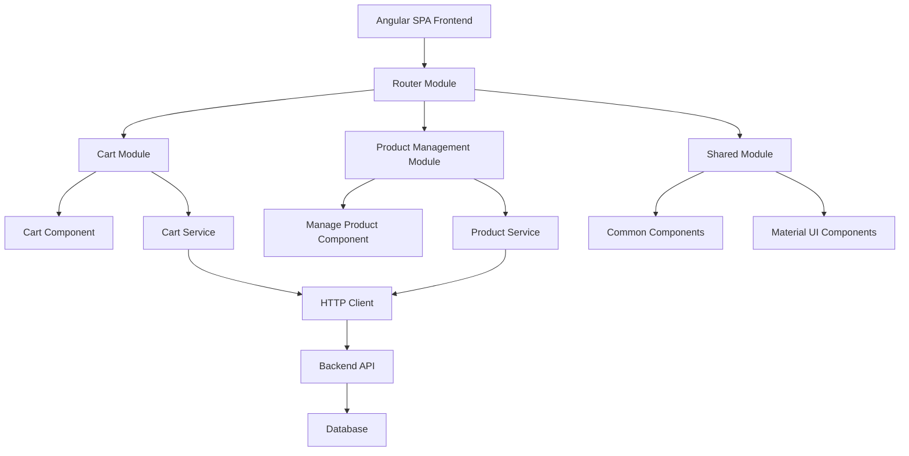

# System Design Specification

## 1. Architecture Overview

### 1.1 High-Level Architecture
This system follows a **Single Page Application (SPA)** architecture using Angular framework with a component-based structure. The application implements a modular design pattern where each major feature (cart, product management, etc.) is organized as separate Angular modules with their own components, services, and routing.



### 1.2 Architecture Diagram
```
┌─────────────────────────────────────────┐
│           Angular Frontend              │
├─────────────────────────────────────────┤
│  ┌─────────────┐  ┌─────────────────┐   │
│  │ Cart Module │  │ Product Module  │   │
│  │             │  │                 │   │
│  │ - Component │  │ - Manage Comp.  │   │
│  │ - Service   │  │ - Service       │   │
│  │ - Routing   │  │ - Routing       │   │
│  └─────────────┘  └─────────────────┘   │
├─────────────────────────────────────────┤
│         Shared Services & Components    │
├─────────────────────────────────────────┤
│              Angular Router             │
└─────────────────────────────────────────┘
```

### 1.3 Technology Stack

**Frontend Technologies:**
- Angular 15+ (TypeScript)
- Angular Material UI
- Angular Router
- RxJS for reactive programming
- Bootstrap 5 for additional styling

**Backend Technologies:**
- Node.js with Express.js (RESTful API)
- TypeScript for type safety

**Database Systems:**
- PostgreSQL for relational data
- Redis for caching (optional)

**Third-party Services:**
- None initially (self-contained system)

**Development Tools:**
- Angular CLI
- npm/yarn package manager
- ESLint + Prettier for code formatting
- Jest for unit testing
- Cypress for E2E testing

## 2. Component Design

### 2.1 Frontend Components

**Cart Component (`cart.component.ts`)**
- **Responsibility**: Display cart interface with navigation and product addition trigger
- **Key Features**:
  - Navigation bar with branding
  - "Añadir producto" button that navigates to product management
  - Responsive layout using Bootstrap classes
- **Interactions**: Routes to manage-product component on button click

**Manage Product Component (`manage-product.component.ts`)**
- **Responsibility**: Handle product creation, editing, and management
- **Key Features**:
  - Product form with validation
  - Save/Cancel operations
  - Navigation back to cart
- **State Management**: Uses Angular Reactive Forms

**Shared Components:**
- Header/Navigation component
- Loading spinner component
- Error message component
- Confirmation dialog component

### 2.2 Backend Services (Angular Services)

**Product Service (`product.service.ts`)**
- **Responsibility**: Handle all product-related operations
- **Methods**:
  - `getProducts()`: Retrieve product list
  - `getProduct(id)`: Get single product
  - `createProduct(product)`: Add new product
  - `updateProduct(id, product)`: Update existing product
  - `deleteProduct(id)`: Remove product

**Cart Service (`cart.service.ts`)**
- **Responsibility**: Manage cart state and operations
- **Methods**:
  - `getCartItems()`: Get current cart contents
  - `addToCart(product)`: Add product to cart
  - `removeFromCart(productId)`: Remove product from cart
  - `updateQuantity(productId, quantity)`: Update item quantity

### 2.3 Database Layer
Uses Angular HTTP Client to communicate with backend API endpoints.

## 3. Data Models

### 3.1 TypeScript Interfaces

```typescript
// Product Model
export interface Product {
  id: string;
  name: string;
  description: string;
  price: number;
  category: string;
  imageUrl?: string;
  stock: number;
  createdAt: Date;
  updatedAt: Date;
}

// Cart Item Model
export interface CartItem {
  id: string;
  productId: string;
  product: Product;
  quantity: number;
  addedAt: Date;
}

// Cart Model
export interface Cart {
  id: string;
  items: CartItem[];
  totalItems: number;
  totalPrice: number;
  createdAt: Date;
  updatedAt: Date;
}

// API Response Wrapper
export interface ApiResponse<T> {
  success: boolean;
  data: T;
  message?: string;
  errors?: string[];
}
```

### 3.2 Data Flow
1. User clicks "Añadir producto" button in cart component
2. Angular Router navigates to manage-product route
3. Manage-product component loads and displays product form
4. User fills form and submits
5. Product service sends HTTP request to backend
6. Backend validates and saves product to database
7. Success response triggers navigation back to cart
8. Cart component refreshes with updated product list

## 4. API Design

### 4.1 Endpoints

```typescript
// Product Endpoints
GET /api/products
Response: ApiResponse<Product[]>
Authentication: Optional

GET /api/products/:id
Response: ApiResponse<Product>
Authentication: Optional

POST /api/products
Request: Partial<Product>
Response: ApiResponse<Product>
Authentication: Required

PUT /api/products/:id
Request: Partial<Product>
Response: ApiResponse<Product>
Authentication: Required

DELETE /api/products/:id
Response: ApiResponse<void>
Authentication: Required

// Cart Endpoints
GET /api/cart
Response: ApiResponse<Cart>
Authentication: Required

POST /api/cart/items
Request: { productId: string, quantity: number }
Response: ApiResponse<CartItem>
Authentication: Required

PUT /api/cart/items/:id
Request: { quantity: number }
Response: ApiResponse<CartItem>
Authentication: Required

DELETE /api/cart/items/:id
Response: ApiResponse<void>
Authentication: Required
```

### 4.2 API Patterns
- RESTful conventions with consistent HTTP status codes
- JSON request/response format
- Standardized error response structure
- Request/Response interceptors for common functionality

## 5. Security Design

### 5.1 Authentication Strategy
- JWT token-based authentication (future implementation)
- Token stored in httpOnly cookies
- Automatic token refresh mechanism

### 5.2 Authorization
- Role-based access (admin, user)
- Route guards for protected pages
- Component-level permission checks

### 5.3 Data Protection
- Input validation using Angular Reactive Forms
- XSS protection via Angular's built-in sanitization
- CSRF protection with Angular's HttpClient

## 6. Integration Points

### 6.1 External Services
Currently none, but designed for future integration:
- Payment gateways (Stripe, PayPal)
- Image upload services (Cloudinary)
- Email services (SendGrid)

### 6.2 Internal Integrations
- Angular Router for navigation
- Angular Material for UI components
- RxJS for reactive data handling

## 7. Performance Considerations

### 7.1 Optimization Strategies
- Lazy loading for feature modules
- OnPush change detection strategy
- Image optimization and lazy loading
- Angular service workers for caching

### 7.2 Scalability
- Modular architecture for easy feature addition
- Reactive forms for efficient form handling
- Observable patterns for data management

## 8. Error Handling and Logging

### 8.1 Error Handling Strategy
```typescript
// Global Error Handler
@Injectable()
export class GlobalErrorHandler implements ErrorHandler {
  handleError(error: any): void {
    console.error('Global error:', error);
    // Send to logging service
  }
}

// HTTP Error Interceptor
@Injectable()
export class ErrorInterceptor implements HttpInterceptor {
  intercept(req: HttpRequest<any>, next: HttpHandler): Observable<HttpEvent<any>> {
    return next.handle(req).pipe(
      catchError((error: HttpErrorResponse) => {
        // Handle HTTP errors
        return throwError(error);
      })
    );
  }
}
```

### 8.2 Logging and Monitoring
- Console logging for development
- Structured logging for production
- Error reporting service integration

## 9. Development Workflow

### 9.1 Project Structure
```
src/
├── app/
│   ├── components/
│   │   ├── cart/
│   │   │   ├── cart.component.ts
│   │   │   ├── cart.component.html
│   │   │   └── cart.component.scss
│   │   └── manage-product/
│   │       ├── manage-product.component.ts
│   │       ├── manage-product.component.html
│   │       └── manage-product.component.scss
│   ├── services/
│   │   ├── product.service.ts
│   │   └── cart.service.ts
│   ├── models/
│   │   ├── product.model.ts
│   │   └── cart.model.ts
│   ├── shared/
│   │   ├── components/
│   │   └── services/
│   ├── app-routing.module.ts
│   └── app.module.ts
├── assets/
└── environments/
```

### 9.2 Development Environment
```typescript
// Environment Variables
export const environment = {
  production: false,
  apiUrl: 'http://localhost:3000/api',
  enableLogging: true
};
```

### 9.3 Testing Strategy
- Unit tests for all components and services (80%+ coverage)
- Integration tests for critical user flows
- E2E tests for main user journeys

## 10. Deployment Architecture

### 10.1 Deployment Strategy
- Development: `ng serve` with hot reload
- Staging: `ng build` with staging configuration
- Production: `ng build --prod` with optimizations

### 10.2 Infrastructure
- **Frontend**: Deploy to Netlify/Vercel for static hosting
- **Backend**: Deploy to Heroku/AWS EC2
- **Database**: PostgreSQL on AWS RDS
- **CDN**: CloudFront for asset distribution

## Implementation Steps

### Phase 1: Navigation Setup
1. Create manage-product component
2. Add routing configuration
3. Implement navigation from cart to manage-product

```typescript
// app-routing.module.ts
const routes: Routes = [
  { path: 'cart', component: CartComponent },
  { path: 'manage-product', component: ManageProductComponent },
  { path: '', redirectTo: '/cart', pathMatch: 'full' }
];

// cart.component.ts
export class CartComponent {
  constructor(private router: Router) {}
  
  onAddProduct(): void {
    this.router.navigate(['/manage-product']);
  }
}

// cart.component.html
<button mat-raised-button color="primary" class="btn-add-product" (click)="onAddProduct()">
  <mat-icon class="me-2">add</mat-icon>Añadir producto
</button>
```

### Phase 2: Product Management Implementation
1. Create product form with Angular Reactive Forms
2. Implement product service
3. Add form validation and error handling

### Phase 3: Integration and Testing
1. Connect frontend with backend API
2. Implement comprehensive testing
3. Add error handling and user feedback

This design provides a solid foundation for implementing the requested navigation functionality while maintaining scalability and best practices for future enhancements.